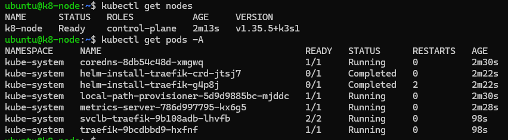
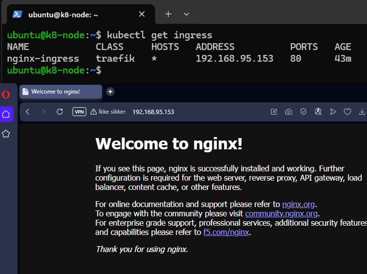
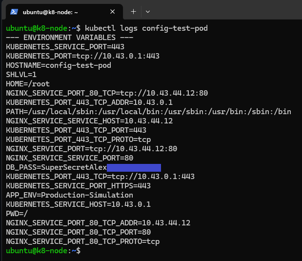
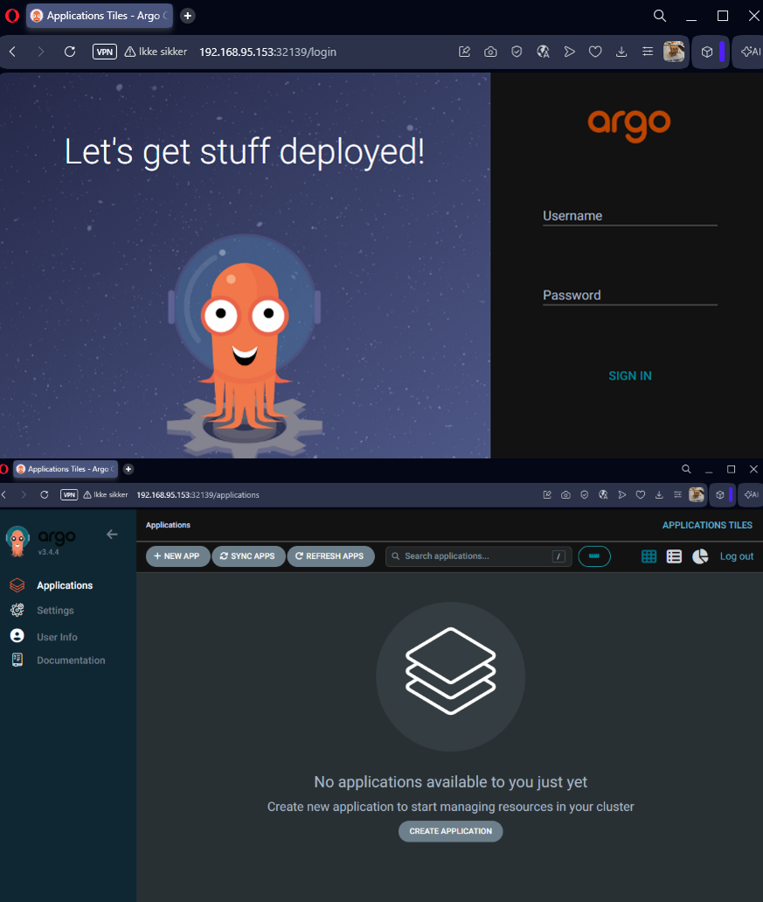
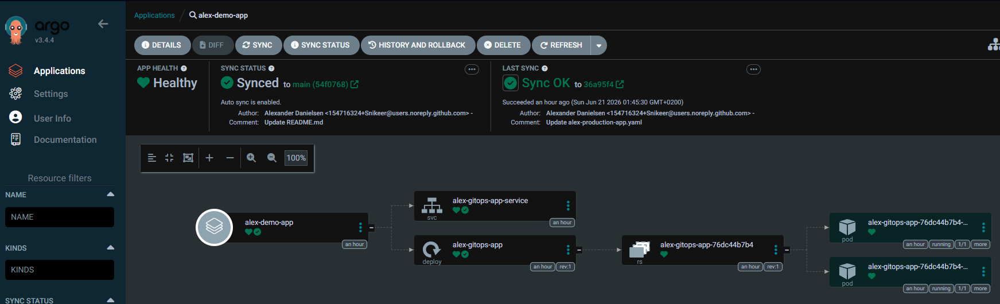

# Kubernetes Enterprise Homelab Platform

A comprehensive, production-grade DevOps and GitOps homelab environment built to simulate modern cloud-native banking infrastructure. This project demonstrates hands-on experience with Linux administration, container orchestration, automated deployments, and observability.

## 🏗️ Architecture Overview
This lab is hosted on a local Linux environment, orchestrating applications using a lightweight Kubernetes distribution, managed via GitOps principles, and monitored with an enterprise-grade observability stack.

*Architecture Diagram coming soon*

## 🛠️ Technology Stack & Skills Demonstrated
- **OS/Infrastructure:** Linux (Ubuntu Server), Virtualization (VMware/VirtualBox)
- **Container Orchestration:** Kubernetes (K3s / Kind)
- **GitOps & CI/CD:** ArgoCD, GitHub
- **Automation & Scripting:** Python, Infrastructure-as-Code (Terraform)
- **Observability:** Prometheus, Grafana

---

## 🚀 Project Roadmap & Progress

### 🖥️ Phase 1: Infrastructure & Linux Foundation
- [x] Setup Linux Virtual Machine (Ubuntu Server)
- [x] Configure SSH, Networking, and Firewall (UFW)
- [x] Install and configure Container Runtime (Docker/Containerd)

### ☸️ Phase 2: Kubernetes Core Setup
- [x] Deploy K3s/Kind Kubernetes Cluster
- [x] Configure Cluster Networking & Ingress Controller (Nginx/Traefik)
- [x] Implement Secret and ConfigMap management

### 🔄 Phase 3: GitOps with ArgoCD
- [x] Install ArgoCD inside the cluster
- [x] Connect this GitHub repository to ArgoCD
- [x] Deploy a sample Python API using GitOps auto-sync

### 📊 Phase 4: Observability & Monitoring
- [ ] Deploy Prometheus and Grafana
- [ ] Create a custom Grafana Dashboard for Cluster Metrics

### 🤖 Phase 5: Python Automation & AI/ML Experimentation
- [ ] Write a Python script using `kubernetes-client` to monitor cluster health
- [ ] Automate self-healing (auto-restart failing pods) or log analysis

---

## 📖 Step-by-Step Implementation Log

### Phase 1: Infrastructure & Linux Foundation

#### 1. Virtual Machine Provisioning
- **Hypervisor:** VMware Workstation
- **OS:** Ubuntu Server 24.04 LTS
- **Specs:** 4 vCPUs, 4GB RAM, 30GB Disk
- **Network IP:** 192.168.95.153

```bash
# Updating and upgrading the system:
sudo apt update && sudo apt upgrade -y
```


#### 2. Firewall & SSH Configuration
To secure the node, the Uncomplicated Firewall (UFW) was enabled, allowing only explicitly permitted traffic, starting with SSH (port 22).

```bash
# Allowing SSH traffic on port 22 through the firewall
sudo ufw allow ssh

# Activating the firewall
sudo ufw enable

# Checking if the firewall is active
sudo ufw status verbose
```


#### 3. Container Runtime Installation (Docker)
To enable container orchestration, Docker was installed and configured as the container runtime interface (CRI). The system user was added to the docker group to allow non-root execution.

```bash
# Installing Docker and configuring group
sudo apt install docker.io -y
sudo systemctl enable --now docker
sudo usermod -aG docker $USER
newgrp docker

# Verifying installation
docker run hello-world
```


### Phase 2: Kubernetes Core Setup

#### 1. K3s Cluster Deployment
A single-node Kubernetes cluster was deployed using K3s. Firewall rules were updated to allow traffic on port 6443 (Kubernetes API server). The kubeconfig file permissions were configured to allow the non-root `ubuntu` user to manage the cluster using kubectl.

- Kubernetes Distribution: K3s v1.35.5+k3s1

```bash
# Opening Kubernetes API port
sudo ufw allow 6443/tcp

# Installing K3s with user access permissions
curl -sfL https://get.k3s.io | sh -s - --write-kubeconfig-mode 644

# Verifying cluster nodes and system pods
kubectl get nodes
kubectl get pods -A
```




#### 2. Cluster Networking & Ingress Routing
To route external HTTP traffic into the cluster, firewall ports 80 and 443 were opened. A test deployment using an Nginx web server was deployed alongside a Kubernetes Service and an Ingress resource managed by the built-in Traefik controller.

```bash
# Opening HTTP and HTTPS ports
sudo ufw allow 80/tcp
sudo ufw allow 443/tcp

# Deploying the Nginx application and Ingress rule
kubectl apply -f ingress-test.yaml

# Verifying ingress routing
kubectl get ingress
```




#### 3. Configuration & Secret Management
To demonstrate secure application configuration, a `ConfigMap` was created for non-sensitive environment variables, and a `Secret` resource was implemented for sensitive data (such as database credentials). A test pod was deployed to inject these resources as environment variables, verifying successful decryption and decoupling of configuration from container images.

```bash
# Applying ConfigMap, Secret, and Test Pod
kubectl apply -f k8s-config-test.yaml

# Inspecting container logs to verify environment variable injection
kubectl logs config-test-pod
```




### Phase 3: GitOps with ArgoCD

#### 1. ArgoCD Installation & Exposure
To adopt modern GitOps practices, ArgoCD was deployed into a dedicated namespace. The `argocd-server` service was patched to use a `NodePort` for external browser access, and UFW firewall rules were configured accordingly.

```bash
# Creating namespace and install ArgoCD
kubectl create namespace argocd
kubectl apply -n argocd -f https://raw.githubusercontent.com/argoproj/argo-cd/stable/manifests/install.yaml

# Exposing ArgoCD UI via NodePort
kubectl patch svc argocd-server -n argocd -p '{"spec": {"type": "NodePort"}}'

#To get that port through the firewall
kubectl get svc -n argocd | grep argocd-server
sudo ufw allow 32139/tcp

# Retrieving auto-generated admin password
kubectl -n argocd get secret argocd-initial-admin-secret -o jsonpath="{.data.password}" | base64 --decode && echo ""
```




--------------------------------------------

--------------------------------------------


## 🛠️ Operational Notes & Troubleshooting (GitOps Stability)

During the GitOps phase, ArgoCD became temporarily unreachable after a system restart. The issue did not affect running workloads, but external access to the ArgoCD UI was lost.

This was investigated using standard Kubernetes debugging methods.

---

### 🔍 Initial Checks

The ArgoCD service exposure was verified:

```bash
kubectl get svc -n argocd | grep argocd-server
```

NodePort configuration confirmed:

```text
argocd-server  NodePort  80:31253/TCP,443:32139/TCP
```

Firewall rules were also checked:

```bash
sudo ufw status verbose
```

At this stage, external configuration appeared correct, but the UI was still unreachable.

---

### 🔁 Service Re-Exposure and NodePort Update

To rule out service misconfiguration, the ArgoCD service was re-applied:

```bash
kubectl patch svc argocd-server -n argocd -p '{"spec": {"type": "NodePort"}}'
```

This caused Kubernetes to assign a new NodePort for HTTPS access:

```text
443:30946/TCP
```

The previous port (`32139`) was no longer active, and firewall rules were updated accordingly:

```bash
sudo ufw allow 30946/tcp
```

---

### 🧪 Root Cause Investigation

The issue was traced to Kubernetes control plane instability after a system restart. This affected internal cluster networking and communication between ArgoCD components and Kubernetes services.

Cluster state was inspected:

```bash
kubectl get pods -n argocd
kubectl get nodes
curl -k https://localhost:30946
```

The investigation revealed that the `argocd-server` pod was in a degraded state (`CrashLoopBackOff`), preventing the service from becoming available.

---

### 🔧 Fix Applied

The Kubernetes service was restarted to restore cluster networking:

```bash
sudo systemctl restart k3s
```

After the control plane was restored, all ArgoCD pods were restarted to ensure a clean runtime state:

```bash
kubectl delete pod -n argocd --all
```

---

### ✅ Result

After recovery:

- Kubernetes networking was restored
- All ArgoCD pods returned to the `Running` state
- GitOps synchronization resumed normally
- UI access via NodePort (`30946`) was restored

No redeployment of applications or changes to Git repository state were required.

-------------------------------------------- 
--------------------------------------------


### Now back to the project.

-------------------------------------------- 
--------------------------------------------


#### 2. GitOps Application Deployment
An application manifest (`apps/alex-production-app.yaml`) was committed to this GitHub repository. ArgoCD was configured to track the `/apps` directory using an automatic synchronization policy (`Self-Heal` and `Prune` enabled). 

Any modifications made to the repository are now automatically reconciled and deployed by ArgoCD into the cluster without manual intervention.

```bash
# Verify resources created by ArgoCD via GitOps
kubectl get deployments
kubectl get pods
```



