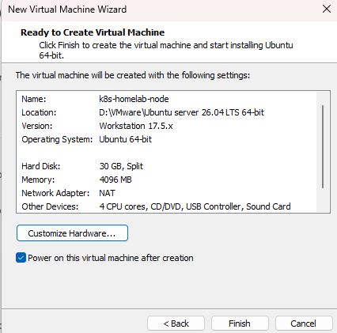
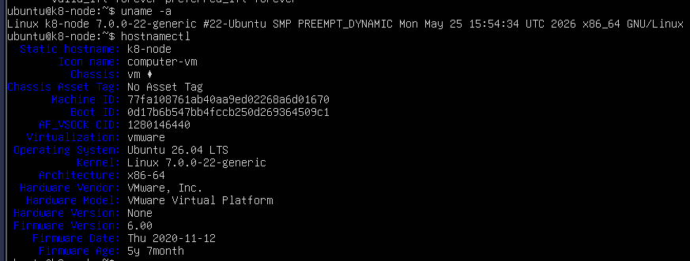
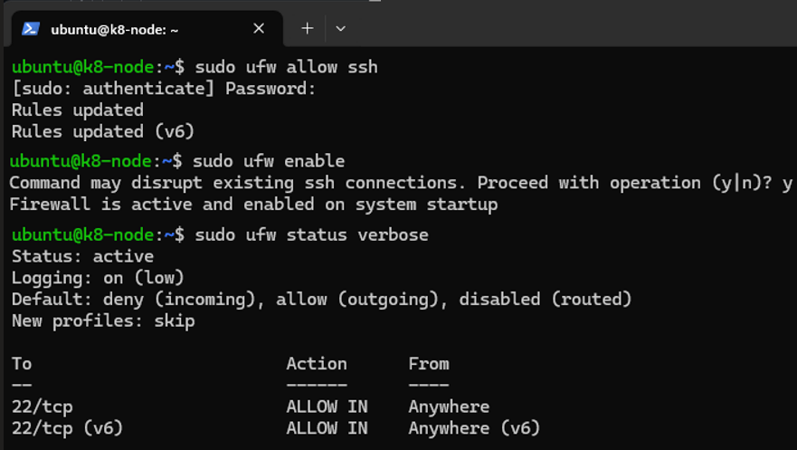
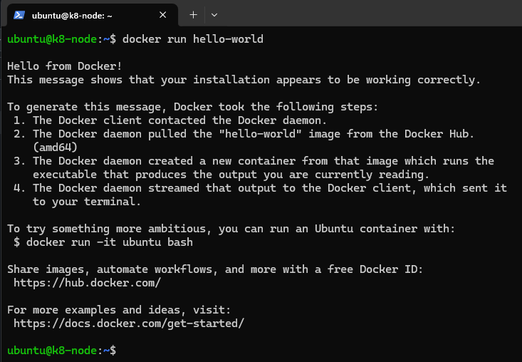

# Kubernetes Enterprise Homelab Platform

A comprehensive, production-grade DevOps and GitOps homelab environment built to simulate modern cloud-native banking infrastructure. This project demonstrates hands-on experience with Linux administration, container orchestration, automated deployments, and observability.

## 🏗️ Architecture Overview
This lab is hosted on a local Linux environment, orchestrating applications using a lightweight Kubernetes distribution, managed via GitOps principles, and monitored with an enterprise-grade observability stack.

*Architecture Diagram coming soon*

## 🛠️ Technology Stack & Skills Demonstrated
- **OS/Infrastructure:** Linux (Ubuntu Server), Virtualization (VMware/VirtualBox)
- **Container Orchestration:** Kubernetes (K3s / Kind)
- **GitOps & CI/CD:** ArgoCD, GitHub
- **Automation & Scripting:** Python, Infrastructure-as-Code (Terraform)
- **Observability:** Prometheus, Grafana

---

## 🚀 Project Roadmap & Progress

### 🖥️ Phase 1: Infrastructure & Linux Foundation
- [x] Setup Linux Virtual Machine (Ubuntu Server)
- [x] Configure SSH, Networking, and Firewall (UFW)
- [x] Install and configure Container Runtime (Docker/Containerd)

### ☸️ Phase 2: Kubernetes Core Setup
- [ ] Deploy K3s/Kind Kubernetes Cluster
- [ ] Configure Cluster Networking & Ingress Controller (Nginx)
- [ ] Implement Secret and ConfigMap management

### 🔄 Phase 3: GitOps with ArgoCD (The "Tieto" Match)
- [ ] Install ArgoCD inside the cluster
- [ ] Connect this GitHub repository to ArgoCD
- [ ] Deploy a sample Python API using GitOps auto-sync

### 📊 Phase 4: Observability & Monitoring
- [ ] Deploy Prometheus and Grafana
- [ ] Create a custom Grafana Dashboard for Cluster Metrics

### 🤖 Phase 5: Python Automation & AI/ML Experimentation
- [ ] Write a Python script using `kubernetes-client` to monitor cluster health
- [ ] Automate self-healing (auto-restart failing pods) or log analysis

---

## 📖 Step-by-Step Implementation Log

### Phase 1: Infrastructure & Linux Foundation

#### 1. Virtual Machine Provisioning
- **Hypervisor:** VMware Workstation
- **OS:** Ubuntu Server 24.04 LTS
- **Specs:** 4 vCPUs, 4GB RAM, 30GB Disk
- **Network IP:** 192.168.95.153

```bash
# Commands executed for initialization:
sudo apt update && sudo apt upgrade -y
```



#### 2. Firewall & SSH Configuration
To secure the node, the Uncomplicated Firewall (UFW) was enabled, allowing only explicitly permitted traffic, starting with SSH (port 22).

```bash
sudo ufw allow ssh
sudo ufw enable
sudo ufw status verbose

```bash
# Allow SSH traffic on port 22 through the firewall
sudo ufw allow ssh

# Activate the firewall
sudo ufw enable

# Check if the firewall is active
sudo ufw status verbose
```



#### 3. Container Runtime Installation (Docker)
To enable container orchestration, Docker was installed and configured as the container runtime interface (CRI). The system user was added to the docker group to allow non-root execution.

```bash
# Install Docker and configure group
sudo apt install docker.io -y
sudo systemctl enable --now docker
sudo usermod -aG docker $USER
newgrp docker

# Verify installation
docker run hello-world
```




